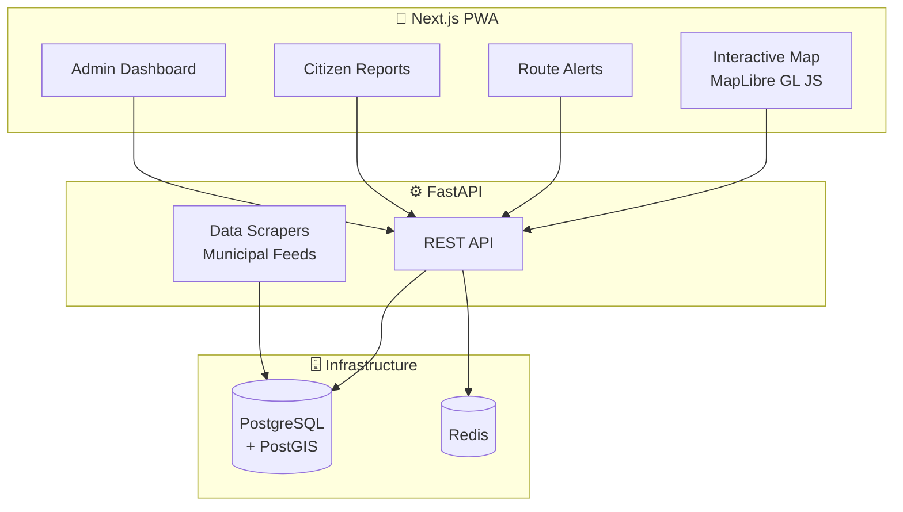

<p align="center">
  <h1 align="center">🏙️ Infra Up — Civic Tech Platform</h1>
  <p align="center"><strong>Citizens, Logistics & Municipalities — All on One Map</strong></p>
  <p align="center">
    A civic tech startup platform letting citizens, logistics companies, and municipal governments see verified construction permits on an interactive map. Smart alerts for route-affecting work, citizen reporting, and government dashboards.
  </p>
</p>

<p align="center">
  
  
  
  
  
  
</p>

---

## ✨ Core Features

- 🗺️ **Interactive Map** — Construction, road, and utility markers with geospatial filtering
- 🔔 **Smart Alerts** — Route-affecting work notifications for commuters and logistics
- 📋 **Permit Transparency** — Full project details with verification documents
- 📸 **Citizen Reporting** — Report unverified construction with photo evidence
- 👨‍💼 **Government Dashboard** — Admin panel for project management and analytics
- 🔄 **Data Scrapers** — Automated ingestion from municipal open-data feeds

---

## 🏗️ Architecture



---

## 📁 Project Structure

```
infra_up/
├── frontend/           # Next.js web application
│   ├── app/            # App Router pages
│   ├── components/     # Map, cards, admin UI
│   └── Dockerfile
├── backend/            # FastAPI Python server
│   ├── app/            # API routes + models
│   ├── scrapers/       # Data ingestion scripts
│   ├── seed.py         # Sample data seeder
│   └── Dockerfile
├── shared/             # Shared definitions + constants
├── plans/              # Phase-by-phase implementation plans
├── docker-compose.yml  # Full stack orchestration
└── vercel.json         # Frontend deployment config
```

---

## 🚀 Quick Start

### Option 1: Docker Compose (Recommended)

```bash
git clone https://github.com/zooshots7/infra_up.git
cd infra_up
docker-compose up --build
```

- 🌐 Frontend: `http://localhost:3000`
- 📡 Backend API: `http://localhost:8000`
- 📖 API Docs: `http://localhost:8000/docs`

### Option 2: Manual Setup

```bash
# Database
docker-compose up db redis -d

# Backend
cd backend
python -m venv venv && source venv/bin/activate
pip install -r requirements.txt
uvicorn app.main:app --reload

# Frontend
cd frontend
npm install && npm run dev
```

---

## 🤝 Contributing

1. Fork the repo
2. Create your feature branch
3. Commit and push
4. Open a Pull Request

## 📄 License

MIT License

---

<p align="center">
  <strong>Making urban infrastructure transparent 🏙️</strong>
</p>
